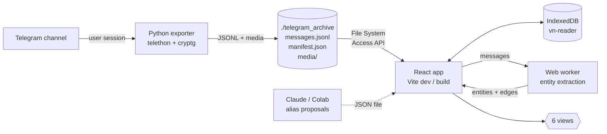

# VN Reader

    

> Read a whole Telegram channel like a long-form book. Export once with Python, then browse it as a quiet, dark-editorial reader with a topic graph, quote-aware threads, and full ⌘K search.

---

## 🚀 30-second start

```powershell
# 1. Export the channel (Python 3.11, .venv311)
.\.venv311\Scripts\Activate.ps1
python telegram_extract_media_quotes.py
# → produces ./telegram_archive/{messages.jsonl, manifest.json, media/}
# When prompted: answer "y" to "Include extra raw payloads" for full formatting

# 2. Run the reader
npm install
npm run dev    # http://localhost:5173

# 3. In the reader: ⌘K → "Import archive folder" → pick ./telegram_archive
```

That's it. Bookmarks, read state, and graph aliases live in your browser's IndexedDB — nothing leaves your machine.

---

## ✨ Try these first

1. Press **⌘K** anywhere — type `first`, hit enter → starts you at message #1
2. ⌘K → type `media:photo Modi` → only photos that mention Modi
3. Open the **Graph** tab → click any entity → connected ones light up Obsidian-style → click `Show all N messages in reader`
4. In any message with a quote block, click the orange italic quote → jumps to the source message with the quoted span highlighted → pill button **`← Back to msg #N`** appears (stacks for deep chains)
5. Click any photo or video → fullscreen lightbox, ESC to close
6. Drag the **width slider** (↔ icon in the top bar) to adjust the reading column between 40ch and 120ch — saved across sessions
7. ⌘K → type `aliases` → import AI-generated alias proposals from a JSON file, review confidence scores and evidence, then apply to the graph in bulk

---

## The six views

### 📖 Read
Single-column reading stream. Day dividers, "First unread" / "Latest" anchors, inline media that opens in a lightbox.
- *Example:* hit **`/`** to focus the inline filter, type any keyword to narrow the stream live.

### ⇉ Threads
Re-derives threads from **quote-replies only** (plain replies don't form threads here). Two-pane: list of conversations on the left, full chain on the right.
- *Example:* click `Bookmark thread` on any chain to come back to it from the Bookmarks tab.

### ⊛ Graph
Entity co-occurrence map. Each dot = a person/place/concept the channel mentions repeatedly. Edges = how often two entities show up in the same message.
- *Example:* drag the `Min mentions` slider to 10 to widen the field, click **Merge entities** to fold `Bullywood` into `Bollywood` — saved as a personal alias for next time.

### ★ Bookmarks
Saved messages and threads with free-form tags. Tag chips visible on each card.
- *Example:* tag a few messages `revisit` then ⌘K → type `bookmarked:` to surface them all.

### ▤ Progress
Read/unread counts, longest unread streak, most-used tags, recent imports. Skim-only, no actions.

### ⇄ Aliases *(via ⌘K)*
AI-assisted entity alias management. Load a `vn-reader-aliases.json` file produced by Claude or a Colab notebook, review each proposal (confidence score, evidence snippets, reasoning), accept/reject/edit, then apply in bulk. Also shows active user aliases with inline editing and removal.
- *Example:* run your archive through Claude → download the proposals JSON → ⌘K → `aliases` → load the file → review → apply. "Natwarlal" becomes "Arvind Kejriwal" everywhere in the graph and search.

---

## ⌘K palette filter syntax

Filters are `key:value` tokens. Free text mixes in. Combine freely.

| Token | Effect |
|---|---|
| `media:photo` (or `video` `audio` `sticker`) | filter by media kind |
| `media:any` | any media at all |
| `from:2024-01-01` / `to:2024-06-30` | date window |
| `entity:Modi` | messages mentioning an entity (alias-aware) |
| `read:` / `unread:` | read state |
| `bookmarked:` | bookmarked only |
| `thread:` | only messages inside a quote-thread |

> *Example:* `entity:Adani unread: from:2024-01-01` → unread messages mentioning Adani since Jan 2024.

---

## 🏗️ Architecture



**Two halves** that don't talk to each other directly:

- **Python exporter** ([telegram_extract_media_quotes.py](telegram_extract_media_quotes.py)) — uses Telethon to fetch the full channel, normalize each message into a stable schema, optionally download media, and write `messages.jsonl` + `manifest.json`.
- **React reader** ([src/](src/)) — reads the archive folder via the File System Access API, mirrors it into IndexedDB, then renders six views off the in-memory snapshot. Heavy work (entity extraction + graph layout) runs in a Web Worker so the UI stays responsive.

### Storage layout (IndexedDB · `vn-reader` v2)

| Store | Key | Holds |
|---|---|---|
| `app_meta` | string | manifest, directory handle |
| `messages` | `chat_id:msg_id` | full message records |
| `threads` | `thread_key` | thread index (re-derived at runtime from quote-replies) |
| `bookmarks` | `bookmark_id` | message + thread bookmarks with tags |
| `read_overrides` | `message_key` | manual read/unread per message |
| `read_cursors` | `chat_id` | "read till here" anchor |
| `import_sessions` | `import_id` | history of imports |
| `user_aliases` | `match` | personal entity merges (e.g. `BJP` → `Bharatiya Janata Party`) |

### File map

```
src/
├── App.tsx                       # shell, routing, nav stack, IDB writes
├── main.tsx                      # mount
├── styles.css                    # one design system, dark editorial
├── types.ts                      # shared record shapes
├── lib/
│   ├── archive.ts                # FS Access API + JSONL parsing → IDB
│   ├── idb.ts                    # IndexedDB wrapper
│   ├── media.ts                  # object-URL cache for photos/videos
│   ├── entities.ts               # regex + stopwords + alias resolution
│   ├── aliases.ts                # default alias dictionary (DS, AS, Tiger…)
│   └── graph-worker.ts           # ?worker — entity co-occurrence + edges
└── components/
    ├── TopBar.tsx                # fixed channel + progress + width slider + ⌘K hint
    ├── CommandPalette.tsx        # cmdk + filter syntax
    ├── ThreadRail.tsx            # right-side thread context drawer
    ├── GraphView.tsx             # react-force-graph-2d + sliders
    ├── MediaLightbox.tsx         # fullscreen media viewer
    ├── MessageCard.tsx           # one message + quote + media + actions
    ├── TelegramRichText.tsx      # Telegram entities → React (bold, italic, links)
    ├── AliasReview.tsx           # AI alias-proposal review + existing alias mgmt
    └── VirtualizedMessageList.tsx# windowed scroll for 4k+ messages
```

---

## 🔧 Exporter advanced

```powershell
# Resume an existing archive (default — pulls only new messages)
python telegram_extract_media_quotes.py

# Retry only failed media downloads
python telegram_extract_media_quotes.py --last-run --retry-failed-media-only

# Repair / re-sort an existing archive (no Telegram calls)
python telegram_extract_media_quotes.py --repair-archive --output-dir telegram_archive

# Audit local archive against the channel (metadata only, no media)
python telegram_extract_media_quotes.py --last-run --audit-source-only

# Backfill external_urls into existing records
python telegram_extract_media_quotes.py --last-run --backfill-urls
```

Reply chains, quote-replies, media metadata, and external URLs are preserved in the archive format. Raw Telegram payloads (`message.raw`) are optional but **required for full formatting fidelity** in the reader (bold, italic, blockquotes, link anchors). Choose `y` at the raw-payloads prompt.

---

## 📝 Notes

- **Telegram session** lives in `telegram_user.session`. Keep it to skip re-login.
- **Last-run settings** live in `.telegram_export_lastrun.json`. `--last-run` flags reuse them.
- **`media/`** can get large. The reader streams files directly from the folder via File System Access — nothing copied into IndexedDB.
- **Browser support:** Chromium (Chrome / Edge / Brave). Firefox lacks File System Access API.
- **Graph perf:** ~3-6s for 4k+ messages on first open (Web Worker). After that, slider tweaks are instant since they filter the cached worker result.
- **Reading width** is saved in `localStorage` (`vn-reader-reading-width`). Adjustable 40ch–120ch, defaults to 68ch.
- **Alias proposals** follow the `vn-reader-aliases` JSON schema (see `src/lib/vn-reader-aliases.json` for a reference file). Generate proposals by feeding your archive into Claude or a Colab notebook, then review them in the Aliases view.

---

Built incrementally with [Claude Code](https://claude.ai/code). Local-first, archive-first, reader-first.
